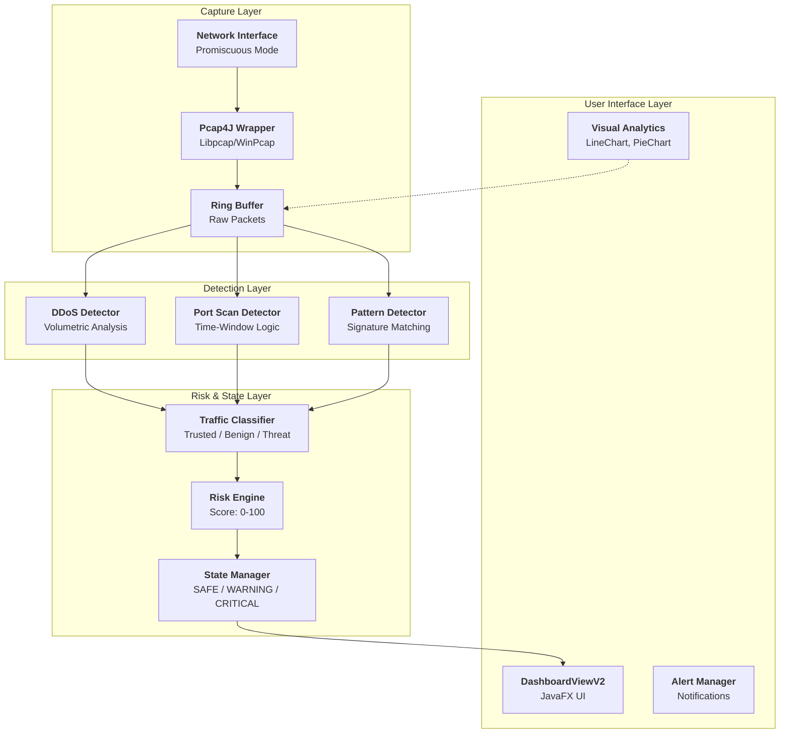
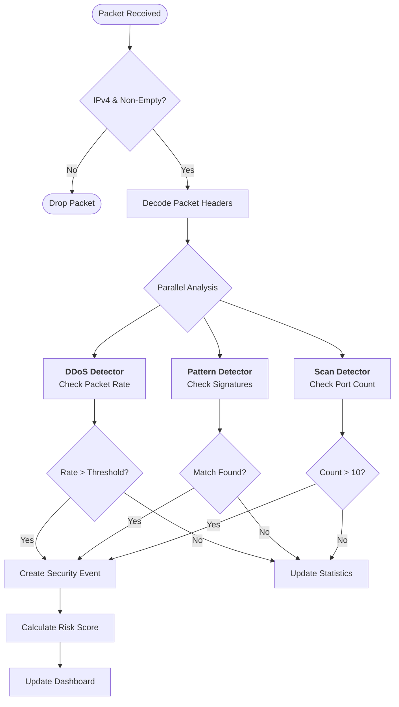
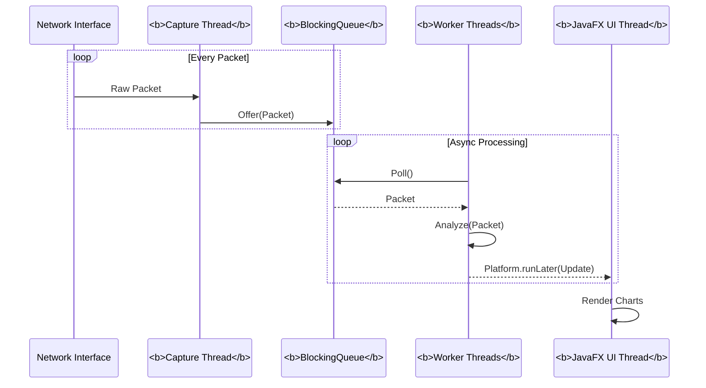
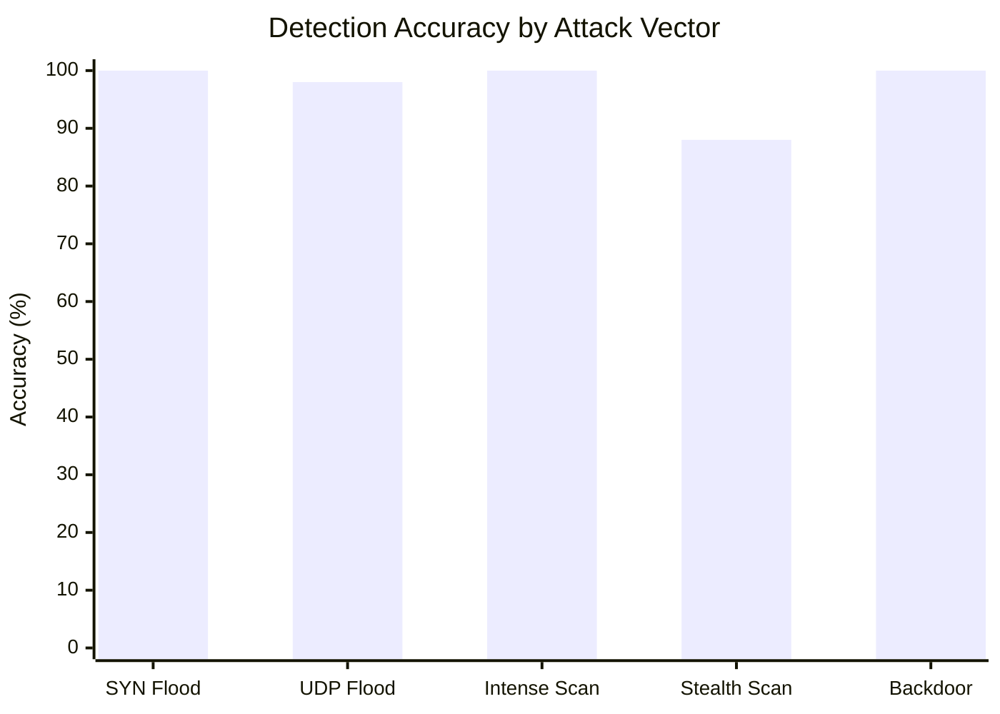

# ThreatScope v2.0 Diagrams

Since you need high-quality diagrams for your IEEE paper, you can use these **MermaidJS** definitions. You can view these in a Markdown editor that supports Mermaid (like VS Code or GitHub) and take screenshots, or use an online editor like [mermaid.live](https://mermaid.live).

## Figure 1: High-Level System Architecture Diagram

## Figure 2: Detection Engine Logic Flow

## Figure 3: Concurrency Model (Producer-Consumer)

## Figure 6: Detection Accuracy (Bar Chart Data)

