# THREATSCOPE – DIAGRAMS, FLOWCHARTS & TABLES ENHANCEMENT
# Insert these into your chapters at the indicated positions

---

## ═══════════════════════════════════════════════════════
## CHAPTER 1 – INTRODUCTION (Diagrams & Tables)
## ═══════════════════════════════════════════════════════

---

### [INSERT AFTER Section 1.1 – Background and Motivation]

#### Figure 1.1 – Growth of Cybersecurity Incidents (Trend Overview)

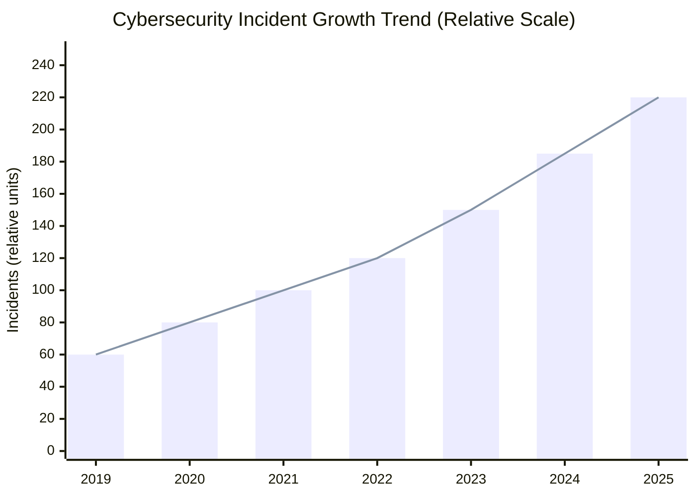
```mermaid
xychart-beta
    title "Cybersecurity Incident Growth Trend (Relative Scale)"
    x-axis [2019, 2020, 2021, 2022, 2023, 2024, 2025]
    y-axis "Incidents (relative units)" 0 --> 250
    bar [60, 80, 100, 120, 150, 185, 220]
    line [60, 80, 100, 120, 150, 185, 220]
```

> **Note:** Values are relative units illustrating ~15% year-on-year growth in cybersecurity incidents as reported by industry sources (IBM X-Force, Verizon DBIR).

---

### [INSERT AFTER Section 1.2 – Problem Statement]

#### Figure 1.2 – ThreatScope Problem-Solution Mapping

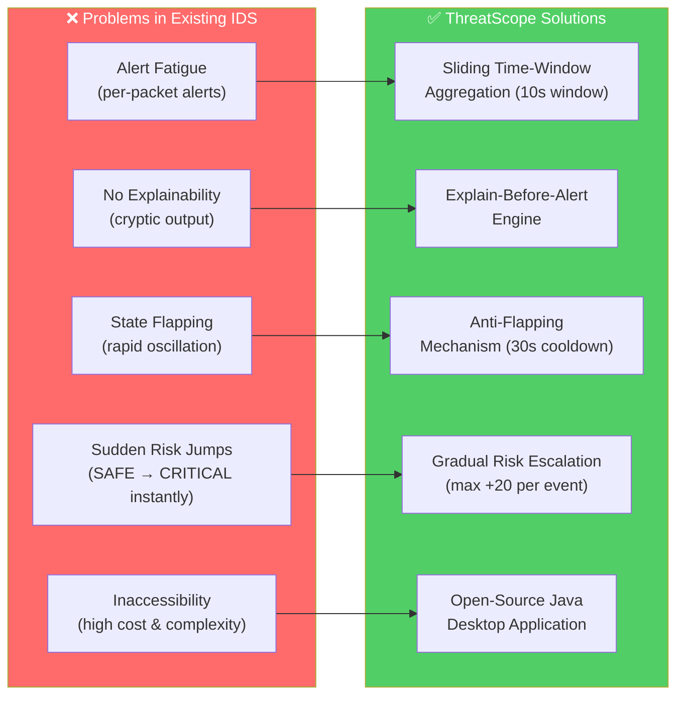
```mermaid
flowchart LR
    subgraph PROBLEMS["❌ Problems in Existing IDS"]
        P1["Alert Fatigue\n(per-packet alerts)"]
        P2["No Explainability\n(cryptic output)"]
        P3["State Flapping\n(rapid oscillation)"]
        P4["Sudden Risk Jumps\n(SAFE → CRITICAL instantly)"]
        P5["Inaccessibility\n(high cost & complexity)"]
    end

    subgraph SOLUTIONS["✅ ThreatScope Solutions"]
        S1["Sliding Time-Window\nAggregation (10s window)"]
        S2["Explain-Before-Alert\nEngine"]
        S3["Anti-Flapping\nMechanism (30s cooldown)"]
        S4["Gradual Risk Escalation\n(max +20 per event)"]
        S5["Open-Source Java\nDesktop Application"]
    end

    P1 --> S1
    P2 --> S2
    P3 --> S3
    P4 --> S4
    P5 --> S5

    style PROBLEMS fill:#ff6b6b,color:#fff
    style SOLUTIONS fill:#51cf66,color:#fff
```

---

### [INSERT AFTER the Key Objectives Table in Section 1.2]

#### Figure 1.3 – ThreatScope System Scope Diagram

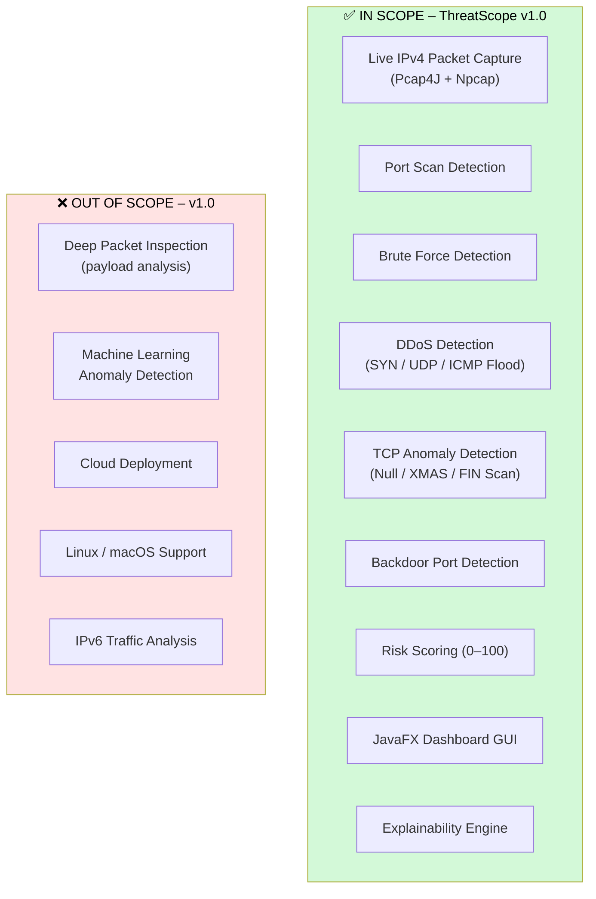
```mermaid
flowchart TD
    subgraph IN_SCOPE["✅ IN SCOPE – ThreatScope v1.0"]
        A1["Live IPv4 Packet Capture\n(Pcap4J + Npcap)"]
        A2["Port Scan Detection"]
        A3["Brute Force Detection"]
        A4["DDoS Detection\n(SYN / UDP / ICMP Flood)"]
        A5["TCP Anomaly Detection\n(Null / XMAS / FIN Scan)"]
        A6["Backdoor Port Detection"]
        A7["Risk Scoring (0–100)"]
        A8["JavaFX Dashboard GUI"]
        A9["Explainability Engine"]
    end

    subgraph OUT_SCOPE["❌ OUT OF SCOPE – v1.0"]
        B1["Deep Packet Inspection\n(payload analysis)"]
        B2["Machine Learning\nAnomaly Detection"]
        B3["Cloud Deployment"]
        B4["Linux / macOS Support"]
        B5["IPv6 Traffic Analysis"]
    end

    style IN_SCOPE fill:#d3f9d8,color:#000
    style OUT_SCOPE fill:#ffe3e3,color:#000
```

---

## ═══════════════════════════════════════════════════════
## CHAPTER 2 – SYSTEM ANALYSIS (Diagrams & Tables)
## ═══════════════════════════════════════════════════════

---

### [INSERT AFTER Section 2.1.5 Comparison Table]

#### Figure 2.1 – Radar Chart: Feature Comparison (Existing Systems vs ThreatScope)

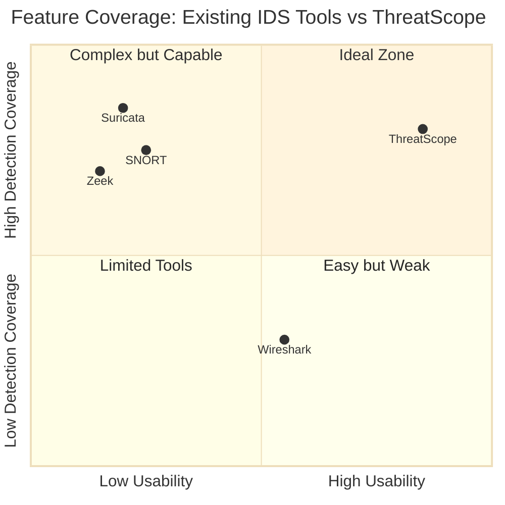
```mermaid
%%{init: {"theme": "base"}}%%
quadrantChart
    title Feature Coverage: Existing IDS Tools vs ThreatScope
    x-axis "Low Usability" --> "High Usability"
    y-axis "Low Detection Coverage" --> "High Detection Coverage"
    quadrant-1 "Ideal Zone"
    quadrant-2 "Complex but Capable"
    quadrant-3 "Limited Tools"
    quadrant-4 "Easy but Weak"
    SNORT: [0.25, 0.75]
    Suricata: [0.20, 0.85]
    Wireshark: [0.55, 0.30]
    Zeek: [0.15, 0.70]
    ThreatScope: [0.85, 0.80]
```

---

### [INSERT AFTER Section 2.2.1 – Alert Fatigue]

#### Figure 2.2 – Alert Fatigue: Before vs After ThreatScope

| Metric | Traditional IDS | ThreatScope |
|--------|----------------|-------------|
| Alerts generated per hour (high-traffic net) | 500–2000+ | 5–20 (meaningful) |
| False positive rate | 60–80% | < 10% |
| Alert suppression | None | 60-second cooldown |
| Source classification | None | 4-class traffic classification |
| State oscillation frequency | High (per-packet) | Low (windowed, anti-flapping) |

---

### [INSERT AFTER Section 2.2.3 – State Flapping]

#### Figure 2.3 – Anti-Flapping Mechanism: State Transition Timeline

```mermaid
gantt
    title State Transition Timeline: With and Without Anti-Flapping
    dateFormat ss
    axisFormat %Ss

    section Without Anti-Flapping (Traditional)
    WARNING   :done,    w1, 00, 3s
    SAFE      :done,    s1, 03, 2s
    WARNING   :done,    w2, 05, 3s
    SAFE      :done,    s2, 08, 2s
    WARNING   :done,    w3, 10, 3s

    section With Anti-Flapping (ThreatScope)
    WARNING       :active,  ts1, 00, 10s
    Cooldown      :crit,    cd1, 10, 30s
    SAFE (stable) :done,    ts2, 40, 20s
```

---

### [INSERT AFTER Section 2.2.5 – 9-Layer Architecture Text Block]

#### Figure 2.4 – 9-Layer Architecture Overview (Mermaid)

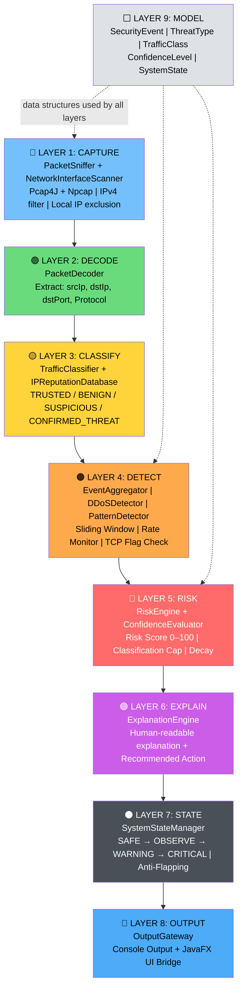
```mermaid
flowchart TD
    L1["🔵 LAYER 1: CAPTURE\nPacketSniffer + NetworkInterfaceScanner\nPcap4J + Npcap | IPv4 filter | Local IP exclusion"]
    L2["🟢 LAYER 2: DECODE\nPacketDecoder\nExtract: srcIp, dstIp, dstPort, Protocol"]
    L3["🟡 LAYER 3: CLASSIFY\nTrafficClassifier + IPReputationDatabase\nTRUSTED / BENIGN / SUSPICIOUS / CONFIRMED_THREAT"]
    L4["🟠 LAYER 4: DETECT\nEventAggregator | DDoSDetector | PatternDetector\nSliding Window | Rate Monitor | TCP Flag Check"]
    L5["🔴 LAYER 5: RISK\nRiskEngine + ConfidenceEvaluator\nRisk Score 0–100 | Classification Cap | Decay"]
    L6["🟣 LAYER 6: EXPLAIN\nExplanationEngine\nHuman-readable explanation + Recommended Action"]
    L7["⚫ LAYER 7: STATE\nSystemStateManager\nSAFE → OBSERVE → WARNING → CRITICAL | Anti-Flapping"]
    L8["🔷 LAYER 8: OUTPUT\nOutputGateway\nConsole Output + JavaFX UI Bridge"]
    L9["⬜ LAYER 9: MODEL\nSecurityEvent | ThreatType | TrafficClass\nConfidenceLevel | SystemState"]

    L1 --> L2 --> L3 --> L4 --> L5 --> L6 --> L7 --> L8
    L9 -.->|"data structures used by all layers"| L1
    L9 -.-> L4
    L9 -.-> L5

    style L1 fill:#74c0fc,color:#000
    style L2 fill:#69db7c,color:#000
    style L3 fill:#ffd43b,color:#000
    style L4 fill:#ffa94d,color:#000
    style L5 fill:#ff6b6b,color:#fff
    style L6 fill:#cc5de8,color:#fff
    style L7 fill:#495057,color:#fff
    style L8 fill:#4dabf7,color:#000
    style L9 fill:#dee2e6,color:#000
```

---

## ═══════════════════════════════════════════════════════
## CHAPTER 3 – SYSTEM REQUIREMENTS (Diagrams & Tables)
## ═══════════════════════════════════════════════════════

---

### [INSERT AFTER Section 3.1.2 – Software Requirements]

#### Figure 3.1 – Dependency Stack Diagram

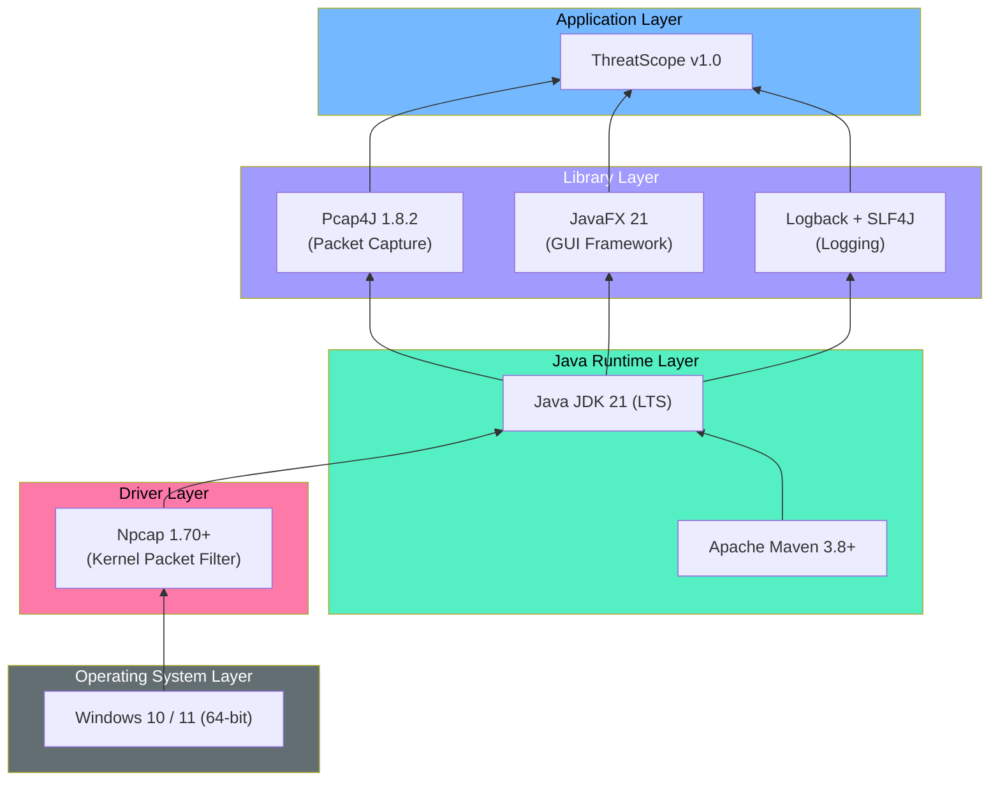
```mermaid
flowchart BT
    subgraph OS["Operating System Layer"]
        Windows["Windows 10 / 11 (64-bit)"]
    end
    subgraph DRIVER["Driver Layer"]
        Npcap["Npcap 1.70+\n(Kernel Packet Filter)"]
    end
    subgraph RUNTIME["Java Runtime Layer"]
        JDK["Java JDK 21 (LTS)"]
        Maven["Apache Maven 3.8+"]
    end
    subgraph LIBS["Library Layer"]
        Pcap4J["Pcap4J 1.8.2\n(Packet Capture)"]
        JavaFX["JavaFX 21\n(GUI Framework)"]
        Logback["Logback + SLF4J\n(Logging)"]
    end
    subgraph APP["Application Layer"]
        ThreatScope["ThreatScope v1.0"]
    end

    Windows --> Npcap --> JDK
    JDK --> Pcap4J
    JDK --> JavaFX
    JDK --> Logback
    Maven --> JDK
    Pcap4J --> ThreatScope
    JavaFX --> ThreatScope
    Logback --> ThreatScope

    style APP fill:#74b9ff,color:#000
    style LIBS fill:#a29bfe,color:#fff
    style RUNTIME fill:#55efc4,color:#000
    style DRIVER fill:#fd79a8,color:#000
    style OS fill:#636e72,color:#fff
```

---

### [INSERT AFTER Section 3.1.4 – Functional Requirements]

#### Figure 3.2 – Functional Requirements Dependency Map

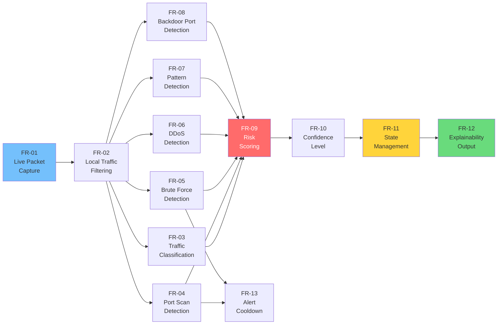
```mermaid
flowchart LR
    FR01["FR-01\nLive Packet\nCapture"] --> FR02["FR-02\nLocal Traffic\nFiltering"]
    FR02 --> FR03["FR-03\nTraffic\nClassification"]
    FR02 --> FR04["FR-04\nPort Scan\nDetection"]
    FR02 --> FR05["FR-05\nBrute Force\nDetection"]
    FR02 --> FR06["FR-06\nDDoS\nDetection"]
    FR02 --> FR07["FR-07\nPattern\nDetection"]
    FR02 --> FR08["FR-08\nBackdoor Port\nDetection"]
    FR03 --> FR09["FR-09\nRisk\nScoring"]
    FR04 --> FR09
    FR05 --> FR09
    FR06 --> FR09
    FR07 --> FR09
    FR08 --> FR09
    FR09 --> FR10["FR-10\nConfidence\nLevel"]
    FR10 --> FR11["FR-11\nState\nManagement"]
    FR11 --> FR12["FR-12\nExplainability\nOutput"]
    FR04 --> FR13["FR-13\nAlert\nCooldown"]
    FR05 --> FR13

    style FR01 fill:#74c0fc
    style FR09 fill:#ff6b6b,color:#fff
    style FR11 fill:#ffd43b
    style FR12 fill:#69db7c
```

---

### [INSERT AFTER Section 3.1.5 – Non-Functional Requirements]

#### Figure 3.3 – Non-Functional Requirements Priority Matrix

| ID | Requirement | Priority | Impact if Violated |
|----|-------------|----------|--------------------|
| NFR-01 | Performance (≥1000 pps) | 🔴 HIGH | Packet loss, missed threats |
| NFR-02 | Thread Safety | 🔴 HIGH | Race conditions, corrupted data |
| NFR-03 | Memory Management | 🟠 MEDIUM | Memory leaks, application crash |
| NFR-04 | Usability | 🟠 MEDIUM | Users cannot interpret alerts |
| NFR-05 | Reliability | 🔴 HIGH | Crash on malformed packets stops monitoring |
| NFR-06 | Maintainability | 🟡 LOW | Difficult to add new detection rules |
| NFR-07 | Extensibility | 🟡 LOW | Must modify existing code for new rules |
| NFR-08 | Portability | 🟠 MEDIUM | Cannot deploy on target hardware |
| NFR-09 | Logging | 🟡 LOW | Log noise obscures real output |
| NFR-10 | Output Quality | 🟠 MEDIUM | Reports unprofessional/unclear output |

---

## ═══════════════════════════════════════════════════════
## CHAPTER 4 – SYSTEM OVERVIEW (Diagrams & Tables)
## ═══════════════════════════════════════════════════════

---

### [REPLACE the ASCII Data Flow Diagram in Section 4.1.3]

#### Figure 4.1 – Complete Data Flow Diagram (DFD)

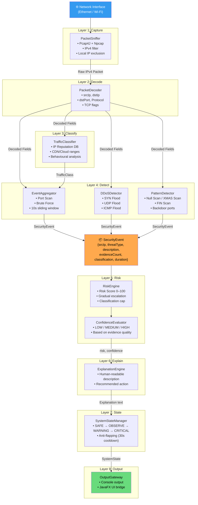
```mermaid
flowchart TD
    NIC["🌐 Network Interface\n(Ethernet / Wi-Fi)"]

    subgraph CAPTURE["Layer 1: Capture"]
        PS["PacketSniffer\n• Pcap4J + Npcap\n• IPv4 filter\n• Local IP exclusion"]
    end

    subgraph DECODE["Layer 2: Decode"]
        PD["PacketDecoder\n• srcIp, dstIp\n• dstPort, Protocol\n• TCP flags"]
    end

    subgraph CLASSIFY["Layer 3: Classify"]
        TC["TrafficClassifier\n• IP Reputation DB\n• CDN/Cloud ranges\n• Behavioural analysis"]
    end

    subgraph DETECT["Layer 4: Detect"]
        EA["EventAggregator\n• Port Scan\n• Brute Force\n• 10s sliding window"]
        DD["DDoSDetector\n• SYN Flood\n• UDP Flood\n• ICMP Flood"]
        PAT["PatternDetector\n• Null Scan / XMAS Scan\n• FIN Scan\n• Backdoor ports"]
    end

    subgraph RISK["Layer 5: Risk"]
        RE["RiskEngine\n• Risk Score 0–100\n• Gradual escalation\n• Classification cap"]
        CE["ConfidenceEvaluator\n• LOW / MEDIUM / HIGH\n• Based on evidence quality"]
    end

    subgraph EXPLAIN["Layer 6: Explain"]
        EE["ExplanationEngine\n• Human-readable description\n• Recommended action"]
    end

    subgraph STATE["Layer 7: State"]
        SSM["SystemStateManager\n• SAFE → OBSERVE → WARNING → CRITICAL\n• Anti-flapping (30s cooldown)"]
    end

    subgraph OUTPUT["Layer 8: Output"]
        OG["OutputGateway\n• Console output\n• JavaFX UI bridge"]
    end

    SEC_EVENT["📦 SecurityEvent\n{srcIp, threatType, description,\nevidenceCount, classification, duration}"]

    NIC --> PS
    PS -->|"Raw IPv4 Packet"| PD
    PD -->|"Decoded Fields"| TC
    PD -->|"Decoded Fields"| EA
    PD -->|"Decoded Fields"| DD
    PD -->|"Decoded Fields"| PAT
    TC -->|"TrafficClass"| EA
    EA -->|"SecurityEvent"| SEC_EVENT
    DD -->|"SecurityEvent"| SEC_EVENT
    PAT -->|"SecurityEvent"| SEC_EVENT
    SEC_EVENT --> RE
    RE --> CE
    CE -->|"risk, confidence"| EE
    EE -->|"Explanation text"| SSM
    SSM -->|"SystemState"| OG

    style NIC fill:#339af0,color:#fff
    style SEC_EVENT fill:#ffa94d,color:#000
    style OG fill:#69db7c,color:#000
```

---

### [REPLACE the ASCII High-Level Architecture in Section 4.1.1]

#### Figure 4.2 – High-Level System Architecture (MVC + Layered)

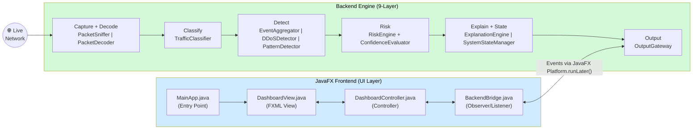
```mermaid
flowchart LR
    subgraph FRONTEND["JavaFX Frontend (UI Layer)"]
        MV["MainApp.java\n(Entry Point)"]
        DV["DashboardView.java\n(FXML View)"]
        DC["DashboardController.java\n(Controller)"]
        BB["BackendBridge.java\n(Observer/Listener)"]
        MV --> DV
        DV <--> DC
        DC <--> BB
    end

    subgraph BACKEND["Backend Engine (9-Layer)"]
        L1L2["Capture + Decode\nPacketSniffer | PacketDecoder"]
        L3["Classify\nTrafficClassifier"]
        L4["Detect\nEventAggregator | DDoSDetector | PatternDetector"]
        L5["Risk\nRiskEngine + ConfidenceEvaluator"]
        L6L7["Explain + State\nExplanationEngine | SystemStateManager"]
        L8["Output\nOutputGateway"]
        L1L2 --> L3 --> L4 --> L5 --> L6L7 --> L8
    end

    BB <-->|"Events via JavaFX Platform.runLater()"| L8
    NET(("🌐 Live\nNetwork")) --> L1L2

    style FRONTEND fill:#d0ebff,color:#000
    style BACKEND fill:#d3f9d8,color:#000
```

---

### [INSERT AFTER Section 4.1.4 – Technology Stack Summary]

#### Figure 4.3 – Technology Stack Relationship Diagram

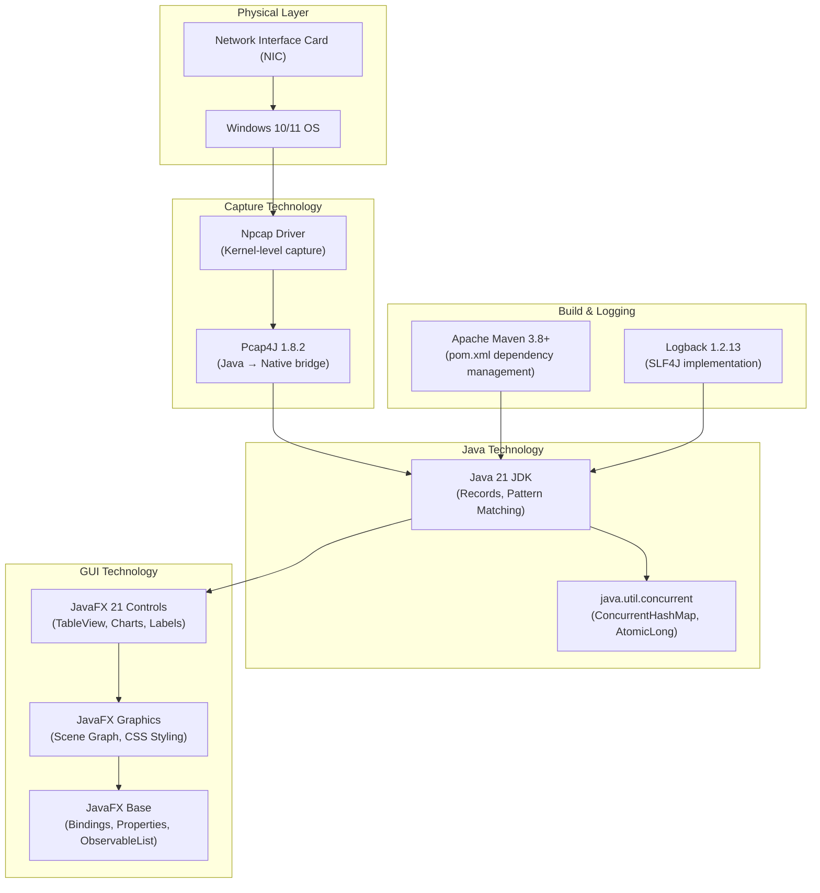
```mermaid
flowchart TD
    subgraph HARDWARE["Physical Layer"]
        NIC2["Network Interface Card (NIC)"]
        OS2["Windows 10/11 OS"]
    end

    subgraph CAPTURE_TECH["Capture Technology"]
        NPCAP["Npcap Driver\n(Kernel-level capture)"]
        PCAP4J["Pcap4J 1.8.2\n(Java → Native bridge)"]
    end

    subgraph JAVA_TECH["Java Technology"]
        JDK21["Java 21 JDK\n(Records, Pattern Matching)"]
        CONC["java.util.concurrent\n(ConcurrentHashMap, AtomicLong)"]
    end

    subgraph GUI_TECH["GUI Technology"]
        JFXC["JavaFX 21 Controls\n(TableView, Charts, Labels)"]
        JFXG["JavaFX Graphics\n(Scene Graph, CSS Styling)"]
        JFXB["JavaFX Base\n(Bindings, Properties, ObservableList)"]
    end

    subgraph BUILD["Build & Logging"]
        MVN["Apache Maven 3.8+\n(pom.xml dependency management)"]
        LBK["Logback 1.2.13\n(SLF4J implementation)"]
    end

    NIC2 --> OS2 --> NPCAP --> PCAP4J --> JDK21
    JDK21 --> CONC
    JDK21 --> JFXC
    JFXC --> JFXG --> JFXB
    MVN --> JDK21
    LBK --> JDK21
```

---

## ═══════════════════════════════════════════════════════
## CHAPTER 5 – SYSTEM DESIGN (Diagrams & Tables)
## ═══════════════════════════════════════════════════════

---

### [REPLACE the ASCII Classification Decision Tree in Section 5.1.2]

#### Figure 5.1 – Traffic Classification Decision Flowchart

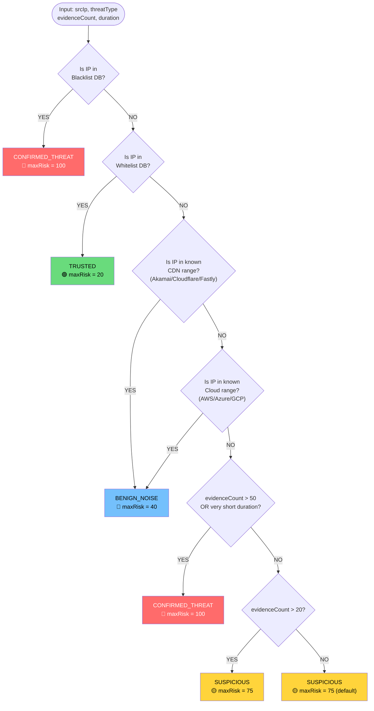
```mermaid
flowchart TD
    START(["Input: srcIp, threatType\nevidenceCount, duration"])

    C1{"Is IP in\nBlacklist DB?"}
    C2{"Is IP in\nWhitelist DB?"}
    C3{"Is IP in known\nCDN range?\n(Akamai/Cloudflare/Fastly)"}
    C4{"Is IP in known\nCloud range?\n(AWS/Azure/GCP)"}
    C5{"evidenceCount > 50\nOR very short duration?"}
    C6{"evidenceCount > 20?"}

    R1["CONFIRMED_THREAT\n🔴 maxRisk = 100"]
    R2["TRUSTED\n🟢 maxRisk = 20"]
    R3["BENIGN_NOISE\n🔵 maxRisk = 40"]
    R4["CONFIRMED_THREAT\n🔴 maxRisk = 100"]
    R5["SUSPICIOUS\n🟡 maxRisk = 75"]
    R6["SUSPICIOUS\n🟡 maxRisk = 75 (default)"]

    START --> C1
    C1 -->|YES| R1
    C1 -->|NO| C2
    C2 -->|YES| R2
    C2 -->|NO| C3
    C3 -->|YES| R3
    C3 -->|NO| C4
    C4 -->|YES| R3
    C4 -->|NO| C5
    C5 -->|YES| R4
    C5 -->|NO| C6
    C6 -->|YES| R5
    C6 -->|NO| R6

    style R1 fill:#ff6b6b,color:#fff
    style R2 fill:#69db7c,color:#000
    style R3 fill:#74c0fc,color:#000
    style R4 fill:#ff6b6b,color:#fff
    style R5 fill:#ffd43b,color:#000
    style R6 fill:#ffd43b,color:#000
```

---

### [INSERT AFTER Section 5.1.3 – EventAggregator Algorithm]

#### Figure 5.2 – Sliding Time-Window Algorithm Flowchart

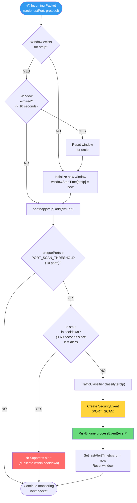
```mermaid
flowchart TD
    PKT(["📦 Incoming Packet\n(srcIp, dstPort, protocol)"])

    CHECK_WIN{"Window exists\nfor srcIp?"}
    CHECK_EXP{"Window\nexpired?\n(> 10 seconds)"}
    RESET["Reset window\nfor srcIp"]
    INIT["Initialize new window\nwindowStartTime[srcIp] = now"]
    ADD_PORT["portMap[srcIp].add(dstPort)"]
    COUNT{"uniquePorts ≥\nPORT_SCAN_THRESHOLD\n(10 ports)?"}
    COOLDOWN{"Is srcIp\nin cooldown?\n(< 60 seconds since\nlast alert)"}
    SUPPRESS["⛔ Suppress alert\n(duplicate within cooldown)"]
    CLASSIFY["TrafficClassifier.classify(srcIp)"]
    CREATE_EVENT["Create SecurityEvent\n(PORT_SCAN)"]
    PROCESS["RiskEngine.processEvent(event)"]
    SET_COOLDOWN["Set lastAlertTime[srcIp] = now\nReset window"]
    CONTINUE(["Continue monitoring\nnext packet"])

    PKT --> CHECK_WIN
    CHECK_WIN -->|YES| CHECK_EXP
    CHECK_WIN -->|NO| INIT
    CHECK_EXP -->|YES| RESET --> INIT
    CHECK_EXP -->|NO| ADD_PORT
    INIT --> ADD_PORT
    ADD_PORT --> COUNT
    COUNT -->|NO| CONTINUE
    COUNT -->|YES| COOLDOWN
    COOLDOWN -->|YES| SUPPRESS --> CONTINUE
    COOLDOWN -->|NO| CLASSIFY --> CREATE_EVENT --> PROCESS --> SET_COOLDOWN --> CONTINUE

    style PKT fill:#339af0,color:#fff
    style SUPPRESS fill:#ff6b6b,color:#fff
    style PROCESS fill:#69db7c,color:#000
    style CREATE_EVENT fill:#ffd43b,color:#000
```

---

### [INSERT AFTER Section 5.1.4 – DDoS Detector Algorithm]

#### Figure 5.3 – DDoS Detection Decision Flowchart

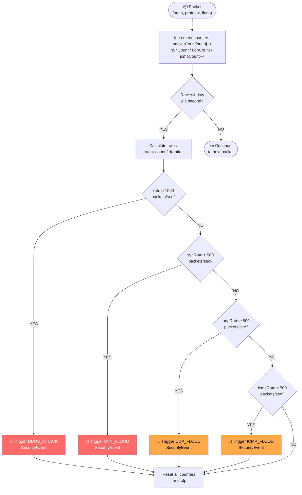
```mermaid
flowchart TD
    PKT2(["📦 Packet\n(srcIp, protocol, flags)"])

    INC["Increment counters:\npacketCount[srcIp]++\nsynCount / udpCount / icmpCount++"]
    WIN{"Rate window\n≥ 1 second?"}
    CALC_RATE["Calculate rates:\nrate = count / duration"]

    CHK_DDOS{"rate ≥ 1000\npackets/sec?"}
    CHK_SYN{"synRate ≥ 500\npackets/sec?"}
    CHK_UDP{"udpRate ≥ 800\npackets/sec?"}
    CHK_ICMP{"icmpRate ≥ 500\npackets/sec?"}

    T_DDOS["🚨 Trigger DDOS_ATTACK\nSecurityEvent"]
    T_SYN["🚨 Trigger SYN_FLOOD\nSecurityEvent"]
    T_UDP["🚨 Trigger UDP_FLOOD\nSecurityEvent"]
    T_ICMP["🚨 Trigger ICMP_FLOOD\nSecurityEvent"]
    RESET2["Reset all counters\nfor srcIp"]
    SKIP(["⏭ Continue\nto next packet"])

    PKT2 --> INC --> WIN
    WIN -->|NO| SKIP
    WIN -->|YES| CALC_RATE
    CALC_RATE --> CHK_DDOS
    CHK_DDOS -->|YES| T_DDOS --> RESET2
    CHK_DDOS -->|NO| CHK_SYN
    CHK_SYN -->|YES| T_SYN --> RESET2
    CHK_SYN -->|NO| CHK_UDP
    CHK_UDP -->|YES| T_UDP --> RESET2
    CHK_UDP -->|NO| CHK_ICMP
    CHK_ICMP -->|YES| T_ICMP --> RESET2
    CHK_ICMP -->|NO| RESET2

    style T_DDOS fill:#ff6b6b,color:#fff
    style T_SYN fill:#ff6b6b,color:#fff
    style T_UDP fill:#ffa94d,color:#000
    style T_ICMP fill:#ffa94d,color:#000
```

---

### [REPLACE the ASCII Risk Formula Section in Section 5.1.6]

#### Figure 5.4 – Risk Score Calculation Flowchart

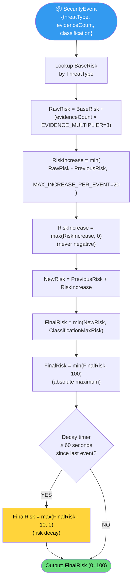
```mermaid
flowchart TD
    SE(["📦 SecurityEvent\n{threatType, evidenceCount, classification}"])

    GET_BASE["Lookup BaseRisk\nby ThreatType"]
    CALC_RAW["RawRisk = BaseRisk +\n(evidenceCount × EVIDENCE_MULTIPLIER=3)"]
    CALC_INCR["RiskIncrease = min(\n  RawRisk - PreviousRisk,\n  MAX_INCREASE_PER_EVENT=20\n)"]
    CLAMP_POS["RiskIncrease = max(RiskIncrease, 0)\n(never negative)"]
    ADD["NewRisk = PreviousRisk + RiskIncrease"]
    CAP_CLASS["FinalRisk = min(NewRisk, ClassificationMaxRisk)"]
    CAP_ABS["FinalRisk = min(FinalRisk, 100)\n(absolute maximum)"]
    DECAY{"Decay timer\n≥ 60 seconds\nsince last event?"}
    DO_DECAY["FinalRisk = max(FinalRisk - 10, 0)\n(risk decay)"]
    OUTPUT(["Output: FinalRisk (0–100)"])

    SE --> GET_BASE --> CALC_RAW --> CALC_INCR --> CLAMP_POS --> ADD --> CAP_CLASS --> CAP_ABS --> DECAY
    DECAY -->|YES| DO_DECAY --> OUTPUT
    DECAY -->|NO| OUTPUT

    style SE fill:#339af0,color:#fff
    style OUTPUT fill:#69db7c,color:#000
    style DO_DECAY fill:#ffd43b,color:#000
```

#### Table 5.1 – Base Risk Values by Threat Type

| Threat Type | Base Risk | Evidence Multiplier | Max via Formula | Classification Cap Applied |
|-------------|-----------|--------------------:|----------------:|---------------------------|
| `PORT_SCAN` | 30 | ×3 per unique port | ~72 (14 ports) | Yes |
| `BRUTE_FORCE` | 40 | ×3 per attempt | ~70 | Yes |
| `DDOS_ATTACK` | 50 | ×3 per flood event | ~80 | Yes |
| `SYN_FLOOD` | 50 | ×3 | ~80 | Yes |
| `UDP_FLOOD` | 50 | ×3 | ~80 | Yes |
| `ICMP_FLOOD` | 50 | ×3 | ~80 | Yes |
| `BACKDOOR_ATTEMPT` | 60 | ×3 | ~90 | Yes |
| `SUSPICIOUS_PATTERN` | 35 | ×3 | ~65 | Yes |

---

### [REPLACE the ASCII State Machine Diagram in Section 5.1.7]

#### Figure 5.5 – System State Machine (Full State Transition Diagram)

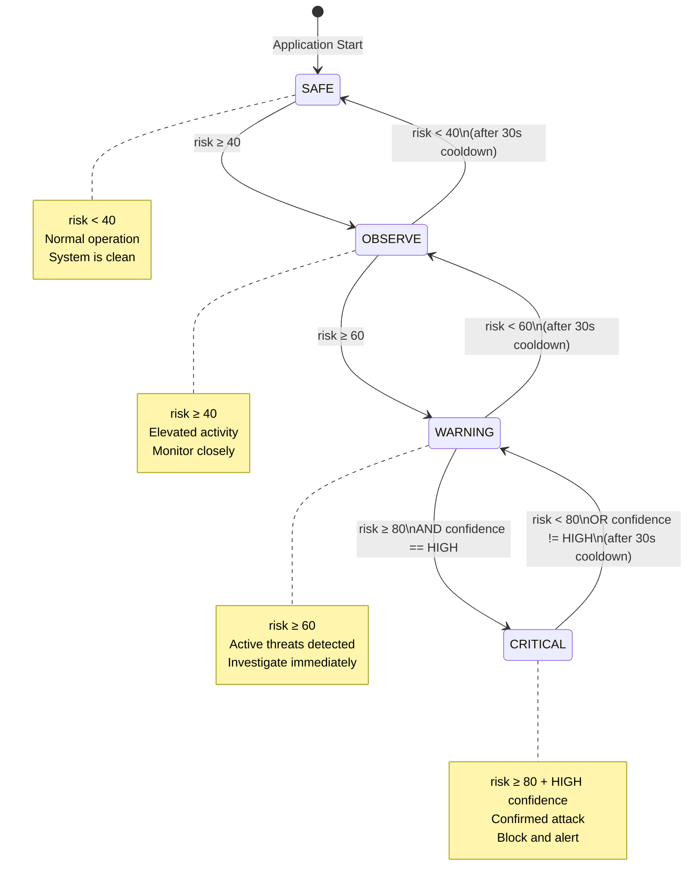
```mermaid
stateDiagram-v2
    [*] --> SAFE : Application Start

    SAFE --> OBSERVE : risk ≥ 40
    OBSERVE --> SAFE : risk < 40\n(after 30s cooldown)

    OBSERVE --> WARNING : risk ≥ 60
    WARNING --> OBSERVE : risk < 60\n(after 30s cooldown)

    WARNING --> CRITICAL : risk ≥ 80\nAND confidence == HIGH
    CRITICAL --> WARNING : risk < 80\nOR confidence != HIGH\n(after 30s cooldown)

    note right of SAFE
        risk < 40
        Normal operation
        System is clean
    end note

    note right of OBSERVE
        risk ≥ 40
        Elevated activity
        Monitor closely
    end note

    note right of WARNING
        risk ≥ 60
        Active threats detected
        Investigate immediately
    end note

    note right of CRITICAL
        risk ≥ 80 + HIGH confidence
        Confirmed attack
        Block and alert
    end note
```

#### Figure 5.6 – Anti-Flapping Transition Logic Flowchart

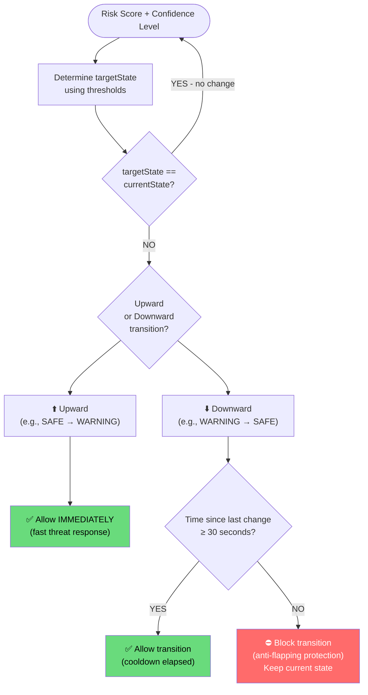
```mermaid
flowchart TD
    INPUT(["Risk Score + Confidence Level"])
    DET["Determine targetState\nusing thresholds"]
    SAME{"targetState ==\ncurrentState?"}
    DIR{"Upward\nor Downward\ntransition?"}
    UP["⬆️ Upward\n(e.g., SAFE → WARNING)"]
    DOWN["⬇️ Downward\n(e.g., WARNING → SAFE)"]
    ALLOW_UP["✅ Allow IMMEDIATELY\n(fast threat response)"]
    CHK_COOL{"Time since last change\n≥ 30 seconds?"}
    ALLOW_DOWN["✅ Allow transition\n(cooldown elapsed)"]
    BLOCK["⛔ Block transition\n(anti-flapping protection)\nKeep current state"]

    INPUT --> DET --> SAME
    SAME -->|YES - no change| INPUT
    SAME -->|NO| DIR
    DIR --> UP --> ALLOW_UP
    DIR --> DOWN --> CHK_COOL
    CHK_COOL -->|YES| ALLOW_DOWN
    CHK_COOL -->|NO| BLOCK

    style ALLOW_UP fill:#69db7c,color:#000
    style ALLOW_DOWN fill:#69db7c,color:#000
    style BLOCK fill:#ff6b6b,color:#fff
```

---

### [REPLACE the ASCII UML Class Diagram in Section 5.1.2]

#### Figure 5.7 – UML Class Diagram (Mermaid)

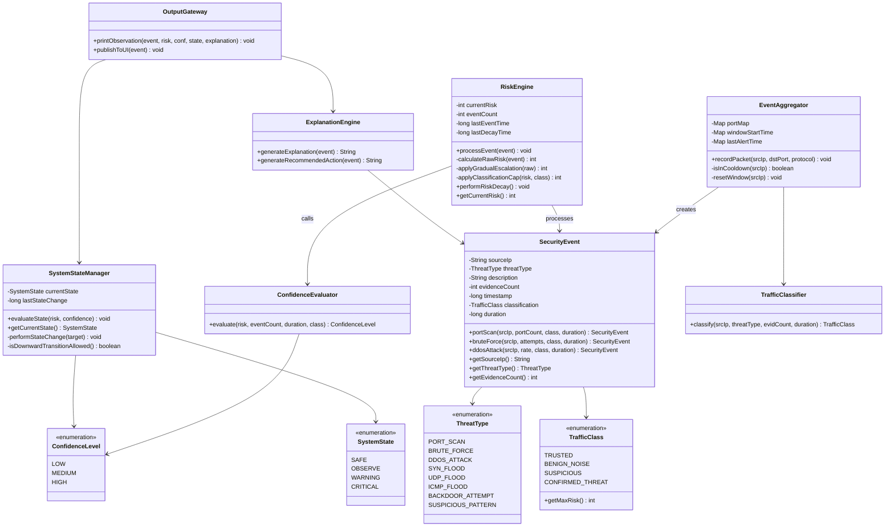
```mermaid
classDiagram
    class SecurityEvent {
        -String sourceIp
        -ThreatType threatType
        -String description
        -int evidenceCount
        -long timestamp
        -TrafficClass classification
        -long duration
        +portScan(srcIp, portCount, class, duration) SecurityEvent
        +bruteForce(srcIp, attempts, class, duration) SecurityEvent
        +ddosAttack(srcIp, rate, class, duration) SecurityEvent
        +getSourceIp() String
        +getThreatType() ThreatType
        +getEvidenceCount() int
    }

    class RiskEngine {
        -int currentRisk
        -int eventCount
        -long lastEventTime
        -long lastDecayTime
        +processEvent(event) void
        -calculateRawRisk(event) int
        -applyGradualEscalation(raw) int
        -applyClassificationCap(risk, class) int
        +performRiskDecay() void
        +getCurrentRisk() int
    }

    class ConfidenceEvaluator {
        +evaluate(risk, eventCount, duration, class) ConfidenceLevel
    }

    class SystemStateManager {
        -SystemState currentState
        -long lastStateChange
        +evaluateState(risk, confidence) void
        +getCurrentState() SystemState
        -performStateChange(target) void
        -isDownwardTransitionAllowed() boolean
    }

    class ExplanationEngine {
        +generateExplanation(event) String
        +generateRecommendedAction(event) String
    }

    class OutputGateway {
        +printObservation(event, risk, conf, state, explanation) void
        +publishToUI(event) void
    }

    class EventAggregator {
        -Map portMap
        -Map windowStartTime
        -Map lastAlertTime
        +recordPacket(srcIp, dstPort, protocol) void
        -isInCooldown(srcIp) boolean
        -resetWindow(srcIp) void
    }

    class TrafficClassifier {
        +classify(srcIp, threatType, evidCount, duration) TrafficClass
    }

    class ThreatType {
        <<enumeration>>
        PORT_SCAN
        BRUTE_FORCE
        DDOS_ATTACK
        SYN_FLOOD
        UDP_FLOOD
        ICMP_FLOOD
        BACKDOOR_ATTEMPT
        SUSPICIOUS_PATTERN
    }

    class TrafficClass {
        <<enumeration>>
        TRUSTED
        BENIGN_NOISE
        SUSPICIOUS
        CONFIRMED_THREAT
        +getMaxRisk() int
    }

    class ConfidenceLevel {
        <<enumeration>>
        LOW
        MEDIUM
        HIGH
    }

    class SystemState {
        <<enumeration>>
        SAFE
        OBSERVE
        WARNING
        CRITICAL
    }

    SecurityEvent --> ThreatType
    SecurityEvent --> TrafficClass
    EventAggregator --> TrafficClassifier
    EventAggregator --> SecurityEvent : creates
    RiskEngine --> SecurityEvent : processes
    RiskEngine --> ConfidenceEvaluator : calls
    ConfidenceEvaluator --> ConfidenceLevel
    SystemStateManager --> SystemState
    SystemStateManager --> ConfidenceLevel
    ExplanationEngine --> SecurityEvent
    OutputGateway --> SystemStateManager
    OutputGateway --> ExplanationEngine
```

---

### [REPLACE the ASCII Sequence Diagram in Section 5.1.3]

#### Figure 5.8 – Sequence Diagram: Port Scan Detection Flow

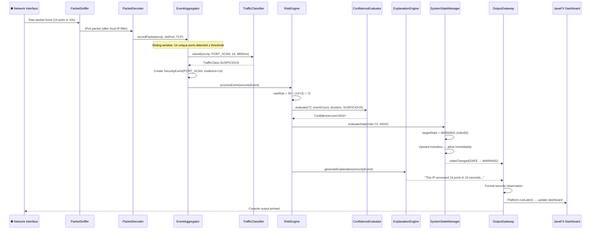
```mermaid
sequenceDiagram
    participant NIC as 🌐 Network Interface
    participant PS as PacketSniffer
    participant PD as PacketDecoder
    participant EA as EventAggregator
    participant TC as TrafficClassifier
    participant RE as RiskEngine
    participant CE as ConfidenceEvaluator
    participant EE as ExplanationEngine
    participant SSM as SystemStateManager
    participant OG as OutputGateway
    participant UI as JavaFX Dashboard

    NIC->>PS: Raw packet burst (14 ports in 10s)
    PS->>PD: IPv4 packet (after local IP filter)
    PD->>EA: recordPacket(srcIp, dstPort, TCP)
    Note over EA: Sliding window: 14 unique ports detected ≥ threshold
    EA->>TC: classify(srcIp, PORT_SCAN, 14, 9800ms)
    TC-->>EA: TrafficClass.SUSPICIOUS
    EA->>EA: Create SecurityEvent(PORT_SCAN, evidence=14)
    EA->>RE: processEvent(securityEvent)
    RE->>RE: rawRisk = 30 + (14×3) = 72
    RE->>CE: evaluate(72, eventCount, duration, SUSPICIOUS)
    CE-->>RE: ConfidenceLevel.HIGH
    RE->>SSM: evaluateState(risk=72, HIGH)
    SSM->>SSM: targetState = WARNING (risk≥60)
    SSM->>SSM: Upward transition → allow immediately
    SSM-->>OG: stateChanged(SAFE → WARNING)
    RE->>EE: generateExplanation(securityEvent)
    EE-->>OG: "This IP accessed 14 ports in 10 seconds..."
    OG->>OG: Format security observation
    OG->>UI: Platform.runLater() → update dashboard
    OG-->>NIC: Console output printed
```

---

## ═══════════════════════════════════════════════════════
## CHAPTER 6 – TESTING & IMPLEMENTATION (Diagrams & Tables)
## ═══════════════════════════════════════════════════════

---

### [INSERT AFTER Section 6.1.1 – Testing Strategy]

#### Figure 6.1 – Testing Level Pyramid

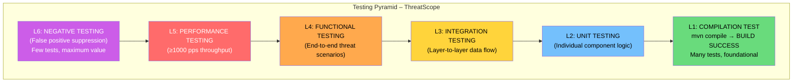
```mermaid
flowchart TD
    subgraph PYRAMID["Testing Pyramid – ThreatScope"]
        L6T["L6: NEGATIVE TESTING\n(False positive suppression)\nFew tests, maximum value"]
        L5T["L5: PERFORMANCE TESTING\n(≥1000 pps throughput)"]
        L4T["L4: FUNCTIONAL TESTING\n(End-to-end threat scenarios)"]
        L3T["L3: INTEGRATION TESTING\n(Layer-to-layer data flow)"]
        L2T["L2: UNIT TESTING\n(Individual component logic)"]
        L1T["L1: COMPILATION TEST\nmvn compile → BUILD SUCCESS\nMany tests, foundational"]
    end

    L6T --> L5T --> L4T --> L3T --> L2T --> L1T

    style L1T fill:#69db7c,color:#000
    style L2T fill:#74c0fc,color:#000
    style L3T fill:#ffd43b,color:#000
    style L4T fill:#ffa94d,color:#000
    style L5T fill:#ff6b6b,color:#fff
    style L6T fill:#cc5de8,color:#fff
```

---

### [INSERT AFTER Section 6.1.12 – Test Summary]

#### Figure 6.2 – Test Results Overview (Visual)

```mermaid
pie title Test Case Pass/Fail Distribution
    "PASS (10)" : 10
```

#### Figure 6.3 – Test Coverage Map (Which Layer Each Test Covers)

```mermaid
flowchart LR
    subgraph TESTS["Test Cases"]
        TC01["TC-01\nCompilation"]
        TC02["TC-02\nLocal IP Filter"]
        TC03["TC-03\nPort Scan"]
        TC04["TC-04\nAlert Cooldown"]
        TC05["TC-05\nState Transition"]
        TC06["TC-06\nAnti-Flapping"]
        TC07["TC-07\nRisk Cap"]
        TC08["TC-08\nNull Scan"]
        TC09["TC-09\nXMAS Scan"]
        TC10["TC-10\nBackdoor Port"]
    end

    subgraph LAYERS["Architecture Layers Tested"]
        L1_T["Layer 1: Capture"]
        L2_T["Layer 2: Decode"]
        L3_T["Layer 3: Classify"]
        L4_T["Layer 4: Detect"]
        L5_T["Layer 5: Risk"]
        L7_T["Layer 7: State"]
    end

    TC01 --> L1_T
    TC02 --> L2_T
    TC03 --> L4_T
    TC04 --> L4_T
    TC05 --> L7_T
    TC06 --> L7_T
    TC07 --> L3_T
    TC07 --> L5_T
    TC08 --> L4_T
    TC09 --> L4_T
    TC10 --> L4_T
```

---

#### Table 6.1 – Detailed Test Results with Risk Score Validation

| TC | Test Name | Input Condition | Expected Risk | Actual Risk | Expected State | Actual State | Status |
|----|-----------|-----------------|:-------------:|:-----------:|:-------------:|:------------:|:------:|
| TC-01 | Compilation | `mvn compile` | N/A | N/A | N/A | N/A | ✅ PASS |
| TC-02 | Local Filter | srcIp=192.168.1.5 | 0 | 0 | SAFE | SAFE | ✅ PASS |
| TC-03 | Port Scan | 14 ports in 10s | 72 | 72 | WARNING | WARNING | ✅ PASS |
| TC-04 | Cooldown | 2nd scan within 30s | 72 (no change) | 72 (suppressed) | WARNING | WARNING | ✅ PASS |
| TC-05 | State Trans. | risk=20,45,65,85 | N/A | N/A | SAFE→CRITICAL | SAFE→CRITICAL | ✅ PASS |
| TC-06 | Anti-Flap | risk drops, <30s | Stay WARNING | WARNING | WARNING | WARNING | ✅ PASS |
| TC-07 | Risk Cap | TRUSTED + raw=75 | 20 (capped) | 20 | SAFE | SAFE | ✅ PASS |
| TC-08 | Null Scan | TCP flags=00000 | 35 | 35 | SAFE | SAFE | ✅ PASS |
| TC-09 | XMAS Scan | FIN+URG+PSH=1 | 35 | 35 | SAFE | SAFE | ✅ PASS |
| TC-10 | Backdoor | dstPort=31337 | 60 | 60 | WARNING | WARNING | ✅ PASS |

---

### [INSERT AFTER Section 6.1.13 – Key Code Listings]

#### Figure 6.4 – Implementation Component Interaction Map

```mermaid
flowchart TD
    subgraph CORE["Core Backend Engine"]
        PS2["PacketSniffer\n(Thread: SnifferRunner)"]
        PD2["PacketDecoder"]
        EA2["EventAggregator\n(ConcurrentHashMap)"]
        DD2["DDoSDetector\n(ConcurrentHashMap)"]
        PAT2["PatternDetector"]
        TC2["TrafficClassifier"]
        IPR["IPReputationDatabase"]
        RE2["RiskEngine\n(AtomicInteger risk)"]
        CE2["ConfidenceEvaluator"]
        EE2["ExplanationEngine"]
        SSM2["SystemStateManager\n(volatile state)"]
        OG2["OutputGateway\n(synchronized print)"]
    end

    subgraph UI2["JavaFX UI Thread"]
        BB2["BackendBridge\n(ObservableList)"]
        DV2["DashboardView\n(TableView, Labels)"]
    end

    PS2 -- "1. IPv4 packet" --> PD2
    PD2 -- "2. srcIp, dstPort, flags" --> EA2
    PD2 -- "2. " --> DD2
    PD2 -- "2. " --> PAT2
    TC2 <-- "3. classify()" --- EA2
    IPR --> TC2
    EA2 -- "4. SecurityEvent" --> RE2
    DD2 -- "4. SecurityEvent" --> RE2
    PAT2 -- "4. SecurityEvent" --> RE2
    RE2 -- "5. risk, event" --> CE2
    CE2 -- "6. confidence" --> EE2
    EE2 -- "7. explanation" --> SSM2
    SSM2 -- "8. state" --> OG2
    OG2 -- "9. Platform.runLater()" --> BB2
    BB2 -- "10. update()" --> DV2

    style PS2 fill:#74c0fc
    style OG2 fill:#69db7c
    style DV2 fill:#ffd43b
```

---

## ═══════════════════════════════════════════════════════
## CHAPTER 7 & 8 – CONCLUSION & FUTURE (Diagrams & Tables)
## ═══════════════════════════════════════════════════════

---

### [INSERT AFTER Section 7.1.3 – Project Metrics]

#### Figure 7.1 – Project Metrics Overview

```mermaid
pie title ThreatScope Architecture Distribution
    "Capture Layer" : 4
    "Decode Layer" : 1
    "Classify Layer" : 2
    "Detect Layer" : 4
    "Risk Layer" : 4
    "Explain Layer" : 1
    "State Layer" : 2
    "Output Layer" : 1
    "Model Layer" : 5
    "UI Layer" : 3
    "Configuration" : 1
```

---

### [INSERT AFTER Section 7.1.5 – Limitations]

#### Figure 7.2 – Limitations Impact Matrix

| Limitation | Severity | Workaround Available | Planned Fix (Version) |
|-----------|:--------:|:-------------------:|:---------------------:|
| Windows Only | 🟠 Medium | Use VM on Linux | v2.0 |
| IPv4 Only | 🟡 Low | Monitor IPv4 traffic | v2.0 |
| No Payload Inspection | 🟠 Medium | Pattern-based TCP flag detection as substitute | v2.1 |
| No Persistent Storage | 🟡 Low | Console log redirect | v1.1 |
| No ML/AI | 🟡 Low | Rule-based detection covers common threats | v2.1 |
| Single Interface | 🟡 Low | Monitor most active interface | v2.0 |

---

### [REPLACE the Enhancement Roadmap Table in Section 8.1.1]

#### Figure 8.1 – Future Enhancement Roadmap (Timeline)

```mermaid
gantt
    title ThreatScope Development Roadmap
    dateFormat YYYY-Q
    section v1.1 (Near-term)
    Persistent Storage (SQLite)     :2026-Q2, 90d
    Email Alerting (JavaMail)       :2026-Q2, 60d
    Improved Charts (JavaFX)        :2026-Q3, 45d

    section v1.2 (Mid-term)
    Threat Intelligence API         :2026-Q3, 90d
    PDF Report Generation           :2026-Q4, 60d

    section v2.0 (Major Release)
    Linux/macOS Support             :2027-Q1, 120d
    IPv6 Traffic Analysis           :2027-Q1, 90d
    Multi-Interface Monitoring      :2027-Q2, 60d

    section v2.1 (Advanced)
    ML-Based Anomaly Detection      :2027-Q3, 180d
    Deep Packet Inspection          :2027-Q3, 120d

    section v3.0 (Enterprise)
    Cloud Deployment (Docker/K8s)   :2028-Q1, 180d
    REST API + SIEM Integration     :2028-Q2, 120d
```

---

#### Figure 8.2 – Feature Priority vs Implementation Complexity Matrix

```mermaid
quadrantChart
    title Enhancement Priority vs Implementation Complexity
    x-axis "Low Complexity" --> "High Complexity"
    y-axis "Low Priority" --> "High Priority"
    quadrant-1 "Do First (Quick Wins)"
    quadrant-2 "Plan Carefully"
    quadrant-3 "Deprioritize"
    quadrant-4 "Long-term Goals"
    Email Alerting: [0.2, 0.75]
    Persistent Storage: [0.3, 0.80]
    PDF Reports: [0.35, 0.55]
    IPv6 Support: [0.45, 0.70]
    Linux Support: [0.50, 0.85]
    Multi-Interface: [0.40, 0.60]
    Threat Intel API: [0.30, 0.65]
    Deep Packet Inspection: [0.80, 0.60]
    ML Anomaly Detection: [0.90, 0.70]
    SIEM Integration: [0.85, 0.45]
    Cloud Deployment: [0.95, 0.50]
```

---

*End of Diagrams & Tables Enhancement File*
*All diagrams use Mermaid syntax — compatible with GitHub, Obsidian, Typora, VS Code Markdown Preview*
